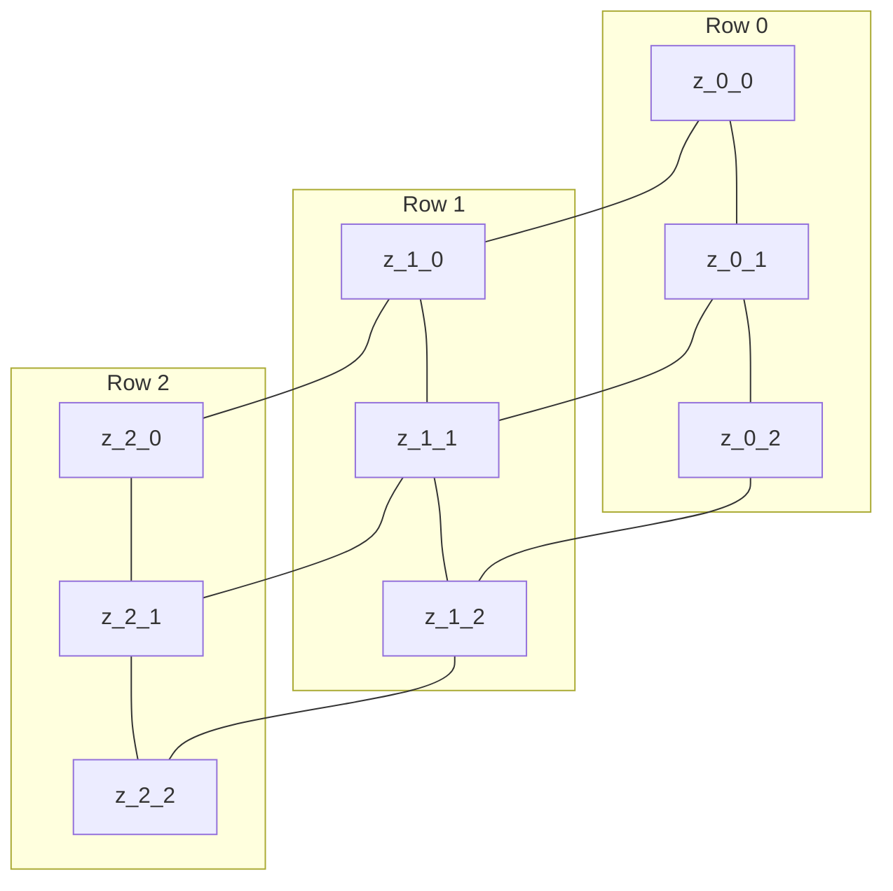

# PDDL Layer Notes

This file explains the domain model, how `problem.pddl` is generated, and how zone IDs like `z_n_m` are computed from continuous simulation coordinates.

## 1) What `shepherding_domain.pddl` Represents

`shepherding_domain.pddl` defines the planning vocabulary and transition rules.

It contains:

- **Requirements**: STRIPS + typing
- **Types**:
    - `zone`
    - `sheep`
- **Predicates**:
    - robot/flock/sheep location predicates (`robot-at-zone`, `flock-at-zone`, `sheep-at-zone`)
    - topology predicate (`zone-adjacent`)
    - goal marker (`zone-is-goal`)
    - flock state flags (`flock-dispersed`, `flock-compact`, `flock-at-goal`)
    - geometric helper (`behind-flock`)
- **Actions**:
    - `move-robot`
    - `collect-outlier`
    - `drive-flock`
    - `pen-flock`

In short: the domain says what can be true and how actions can change truth values.

---

## 2) What `problem.pddl` Represents

`problem.pddl` is a snapshot of the current simulation state, translated into symbolic facts for planning.

It contains:

- **Objects**: all grid zones (`z_0_0`, `z_0_1`, ...) and, when needed, outlier sheep (`sheep14`, etc.)
- **Initial facts (`:init`)**:
  - robot location: `(robot-at-zone z_r_c)`
  - flock location: `(flock-at-zone z_r_c)`
  - flock state: either `(flock-dispersed)` or `(flock-compact)`
  - zone graph connectivity: `(zone-adjacent a b)`
  - goal zone marker: `(zone-is-goal z_g_r)`
  - driving geometry helper: `(behind-flock rz fz gz)`
- **Goal**: `(:goal (flock-at-goal))`

The domain actions in `shepherding_domain.pddl` consume these facts to produce a plan.

---

## 3) How `problem_generator.py` Builds the Problem

`problem_generator.py` is the bridge between the abstraction output and the final `problem.pddl` text.

Main entry point:

- `generate_problem(abstract_state, domain_name, problem_name, output_path)`

Expected `abstract_state` fields:

- `all_zones`
- `robot_zone`
- `flock_zone`
- `flock_dispersed`
- `outlier_ids`
- `sheep_zones`
- `adjacent_pairs`
- `goal_zone`
- `behind_triples`

Generation flow:

1. Writes the PDDL header and domain binding.
2. Emits all zone objects, and sheep objects only for outliers.
3. Emits init facts in this order:
    - robot/flock location
    - flock state (`flock-dispersed` or `flock-compact`)
    - outlier sheep positions
    - bidirectional adjacency
    - goal zone marker
    - `behind-flock` triples
4. Emits the goal: `(flock-at-goal)`.
5. Writes the final text to `output_path`.

Important consistency rule:

- Exactly one flock state flag is emitted: `flock-dispersed` or `flock-compact`.

---

## 4) Meaning of `z_n_m`

Zone ID format:

- `n` = row index (derived from **y**)
- `m` = column index (derived from **x**)

So `z_0_0` is the lower-left cell of the grid, while larger indices move upward/rightward.

---

## 5) Metrics Used to Build Zones

The abstraction is implemented in `shepherding/world_abstraction.py`.

### 5.1 Cell Size

For bounds `[xmin, ymin, xmax, ymax]` and grid size `N`:

- `cell_w = (xmax - xmin) / N`
- `cell_h = (ymax - ymin) / N`

### 5.2 Coordinate -> Zone Index

Given a continuous point `(x, y)`:

- `col = floor((x - xmin) / cell_w)`
- `row = floor((y - ymin) / cell_h)`
- then clip both to `[0, N-1]`

Zone name is built as `z_{row}_{col}`.

### 5.3 Flock Zone

- Compute sheep centroid `c = mean(sheep_positions)`
- Convert centroid to `(row, col)`
- Emit `(flock-at-zone z_row_col)`

### 5.4 Dispersed vs Compact

- Compute each sheep distance to centroid: `||p_i - c||`
- If `max_i ||p_i - c|| > collect_threshold` -> `flock-dispersed`
- Else -> `flock-compact`

### 5.5 Region Connectivity Metric

The planner uses a **4-connected grid** (Von Neumann neighborhood):

- right: `(r, c) -> (r, c+1)`
- up: `(r, c) -> (r+1, c)`

Then both directions are emitted as adjacency facts.

### 5.6 Behind-Flock Relation (Drive Geometry)

For each robot-zone candidate `R`, flock zone `F`, and goal zone `G`:

- `v_fg = G - F` (direction from flock to goal)
- `v_fr = R - F` (direction from flock to robot)
- if `dot(v_fg, v_fr) < 0`, then `R` is considered "behind" the flock relative to the goal.

This is encoded as `(behind-flock R F G)`.

---

## 6) Mermaid Diagram: Abstraction Pipeline

```mermaid
flowchart LR
    A[Continuous State\nSheep positions + Robot position + Goal] --> B[Compute Flock Centroid]
    B --> C[Map Positions to Grid Cells]
    C --> D[Emit Zone Facts\nrobot-at-zone, flock-at-zone]
    B --> E[Compute Dispersion\nmax distance to centroid]
    E --> F[Emit flock-dispersed OR flock-compact]
    C --> G[Build 4-neighbor Adjacency\nzone-adjacent]
    C --> H[Compute behind-flock triples\n(dot product test)]
    D --> I[problem.pddl]
    F --> I
    G --> I
    H --> I
    I --> J[pyperplan]
    J --> K[Symbolic Plan]
```

---

## 7) Mermaid Diagram: Region Grid Example (3x3)

Example zone naming pattern (same convention as 5x5 or NxN):



Interpretation:

- horizontal links: same row, adjacent columns
- vertical links: same column, adjacent rows
- this is the same 4-connected topology used to create `zone-adjacent`

---

## 8) Quick Debug Checklist

If planning output looks odd:

- open `problem.pddl` and verify robot/flock zones are sensible
- verify exactly one of `flock-dispersed` or `flock-compact` is present
- confirm goal zone exists and is reachable in adjacency graph
- inspect whether required `behind-flock` triples are present for current flock zone
